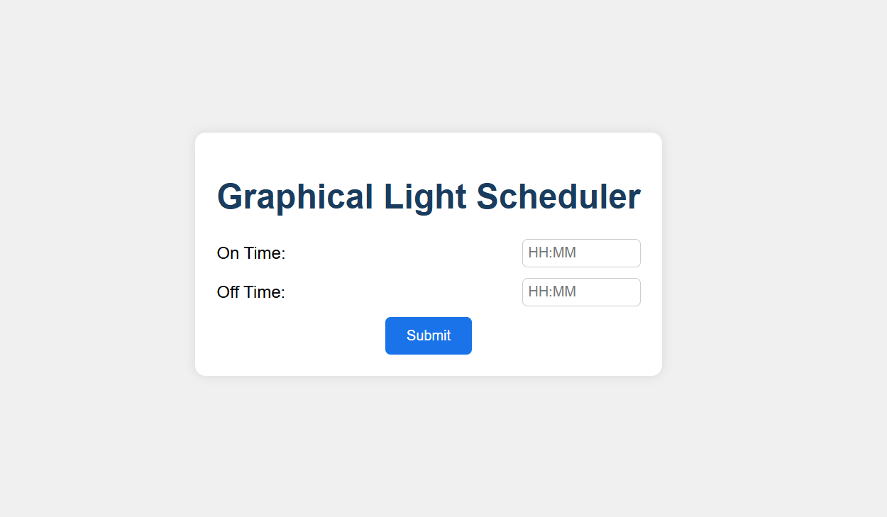

# Graphical Light Scheduler

A web-based IoT dashboard to schedule a light using WebSocket and MQTT communication.

## Objective
Simulate a real-world IoT application where a user schedules a light's ON/OFF times via a graphical interface. The schedule is sent to a WebSocket server, forwarded to an MQTT broker, and processed by a subscriber that controls an Arduino-connected relay.

## Tech Stack
- **Frontend**: HTML, CSS, JavaScript (WebSocket client)
- **Backend**: Python (WebSocket server using `websockets`)
- **MQTT Subscriber**: Python (using `pyserial` and `mosquitto_sub`)
- **Communication**: Mosquitto (MQTT broker), WebSocket
- **Hardware**: Arduino UNO (pre-programmed to act on serial input)

## Project Structure
- `index.html`: Frontend interface to input ON/OFF times.
- `websocket_server.py`: WebSocket server to receive schedules and publish to MQTT.
- `mqtt_subscriber.py`: MQTT subscriber to process schedules and control the Arduino.

## Prerequisites
1. **Mosquitto MQTT Broker**: Install Mosquitto (`sudo apt install mosquitto mosquitto-clients` on Linux) and ensure it's running on `localhost`.
2. **Python Dependencies**:
   - `websockets`: `pip install websockets`
   - `pyserial`: `pip install pyserial`
3. **Arduino**: Connected via USB, pre-programmed to read serial commands ('1' to turn on, '0' to turn off).
4. **Serial Port**: Identify your Arduino's port (e.g., `/dev/ttyUSB0` on Linux or `COM3` on Windows).

## Setup Instructions
1. **Clone the Repository**:
   ```bash
   git clone <your-repo-url>
   cd <your-repo-name>
```

2. **Start the MQTT Broker**: Ensure Mosquitto is running:

   ```bash
   mosquitto
   ```

3. **Run the WebSocket Server**:

   ```bash
   python websocket_server.py
   ```

   The server will run on `ws://localhost:8765`.

4. **Run the MQTT Subscriber**: Update the serial port in `mqtt_subscriber.py` if needed, then run:

   ```bash
   python mqtt_subscriber.py
   ```

5. **Open the Frontend**: Open `index.html` in a browser (e.g., via a local server like `python -m http.server`).

## Usage

1. Open the webpage (`index.html`).
2. Enter the ON and OFF times in `HH:MM` format (e.g., `14:30`).
   1. Click "Submit" to send the schedule.
3. The schedule is sent to the WebSocket server, published to the MQTT topic `light/schedule`, and processed by the subscriber.
4. The subscriber compares the current time with the schedule and sends '1' (on) or '0' (off) to the Arduino via serial.

## Screenshots



## Troubleshooting

- Ensure Mosquitto is running and accessible on `localhost`.
- Check the serial port in `mqtt_subscriber.py` matches your Arduino's port.
- Verify the Arduino is programmed to interpret '1' and '0' correctly.

## Deliverables

- Full code in this GitHub repo.
- README with instructions (this file).
